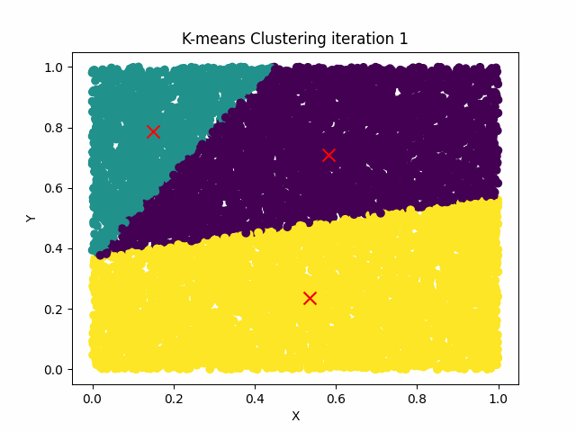
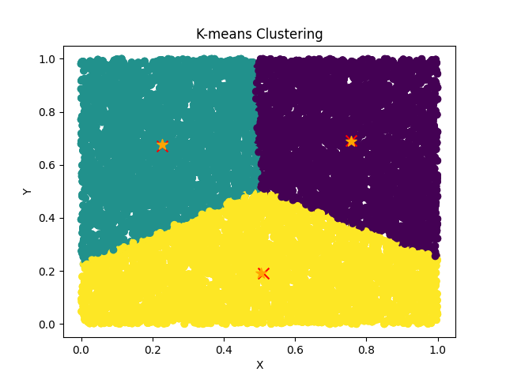
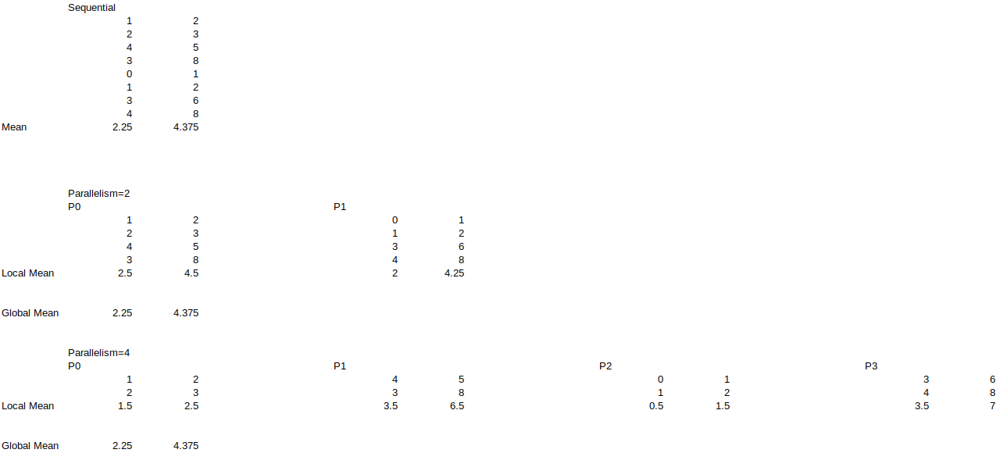

# HPC with Machine Learning

We will be learning about a few machine learning algorithms in this section. 
Then we will study how to parallelize this workload.

## Pre-requisites

```bash
pip install pandas matplotlib scikit-learn imageio
```


## KMeans Clustering

### Sequential Algorithm

K-means clustering is a popular unsupervised machine learning algorithm used for clustering analysis. It aims to partition a given dataset into k clusters, where each data point belongs to the cluster with the nearest mean (centroid). The number of clusters, k, is specified by the user.

The algorithm works as follows:

1. Initialization: Randomly select k data points as the initial centroids.

2. Assignment: Assign each data point to the nearest centroid based on a distance metric (usually Euclidean distance).

3. Update: Recalculate the centroids by taking the mean of all data points assigned to each centroid.

4. Repeat steps 2 and 3 until convergence (either a maximum number of iterations is reached or the centroids do not change significantly between iterations).

The goal of K-means clustering is to minimize the sum of squared distances between each data point and its assigned centroid. This objective function is often referred to as within-cluster variance or inertia.

K-means clustering has several applications, including customer segmentation, image compression, anomaly detection, and document clustering. However, it is important to note that K-means is sensitive to the initial centroid positions and can converge to suboptimal solutions. Therefore, it is common to run the algorithm multiple times with different initializations and select the solution with the lowest inertia.

[Source Code](kmeans.py)

```bash
import numpy as np
np.random.seed(123)

K = 3
N = 10000
M = 2

X = np.random.rand(N, M)
max_iter = 300


kmeans = KMeans(n_clusters=K, max_iter=max_iter)
kmeans.fit(X)

print(kmeans.centroids)
print(kmeans.labels)

```

### Visualizing Training




### Visualizing Final Output comparison

Here we are comparing the output from our code and Scikit-Learn.
Note `X` and `*` are the symbols used for plotting the centroids.




### Distributed Algorithm

There are K clusters that we hope to find for the given dataset.

Let'sLet's assume there are N data points, each with M features. For visualization purposes,

let'slet's assume M=2 so that we can plot the data in 2D.

    Initialize the centroids: Centroids refer to the coordinates for K clusters we will find. We can randomly K existing data points from the dataset, i.e. X.
    Then we would calculate the Euclidean distance from each K cluster to each data point and assign each to the closest cluster. And each data point would have a label showing which cluster it belongs to.
    We will do step 2 until the formulated new centroid doesn'tdoesn't change much. Here we would choose a threshold to determine that. We call an iteration or an epoch when we do the computation as mentioned earlier and assign a cluster to each data point. Once we do that, we will know the data points associated with that cluster. We would average the values for all data points per cluster to calculate the new centroid.

Now let's think about the parallel program

Which parts of this program can be parallelized?

The program has three main steps, as explained above, and let'slet's take them one by one and see what can be parallelized.

A program is a transformation of input data and producing output data. So we should think about parallelizing the programme using a data partitioning approach. We could write this programme in two ways and think about it in two ways.

    Data can be loaded into the device memory, and the computation can be done sequentially. Still, we need to improve the performance of the execution, so we need to parallelize the workload.
    Data doesn'tdoesn't fit into a single device's memory, so we must use multiple devices to run this programme. We would load the data from the disk in a parallel manner for each device and parallelize the workload.

In initializing centroids, we would select K number of data points, and this could be done sequentially as this may not need parallelism. But let'slet's view all data from a designated process, and from there, let's select the centroids and broadcast that to everyone. Since other processes doesn'tdoesn't know about the centroids. Also, we need to partition the data and send each process an equal amount of data to balance the load. If the load cannot be equally balanced, we could do it approximately to ensure computation is not skewed for each process. But we could select the number of data points divisible by the number of processes for learning purposes.

To partition the data, we could use the scatter collective communication call. It won'twon't be an ideal shuffling of data, but for the learning purpose, that is adequate for the scope of the class.

Now each process knows the initial centroids and the it'sit's data. By doing this, we have divided the computation workload into K number of processes. Theoretically, the workload should be K times faster, ignoring synchronization costs.

So far, we have covered step 1 of the algorithm.

Now let's think about step 2.


Then we would calculate the Euclidean distance from each K cluster to each data point and assign each to the closest cluster. And each data point would have a label showing which cluster it belongs to.

Calculating Euclidean distance doesn'tdoesn't need parallelism. And assignment operation to the closest cluster is also a local operation (meaning that it can be handled within the process and doesn'tdoesn't need communication). This assignment stage can be done without thinking about parallelism, but we have already partitioned the data, so this part of the code is trivially parallelized.

Now we need to figure out the new centroids. To do that, we would take the mean of the data points belonging to a particular cluster and assign it as the new centroid. That'sThat's what we did in the sequential programme. In the distributed programme, we cannot see all the data in each process, so the mean value we would be taking would be accurate for the data within that process but not for the global data set. So when calculating the new centroids, we should take the mean value for the overall data set.

How can we take the mean of the overall data set? AllReduce comes to our rescue.

Remember what we already did to take the average grades for students facing an exam; we used the same strategy.

We would calculate the local_new_centroid and then do the AllReduce operation on that data with MPI.SUM operator. Let's look at the following example of taking the average on a data point containing two features (in machine learning sense).



You can see that through various parallelism, we can achieve the same results. Here, we should take the local mean for each process, sum it up across all processes, and divide that value by the number of processes involved. Now you see how AllReduce can come to the rescue.

local_centroids[i] = np.mean(data[labels == i], axis=0)
local_centroids[i] = comm.allreduce(local_centroids[i], op=MPI.SUM) / comm.world_size

Now, the local_centroids variable should have been updated for each process for each i^th centroid.
It's essential to note that K-means are sensitive to the initial placement of centroids, and different initializations can lead to different results.
The algorithm is often run multiple times with different random initializations, and the best result is selected based on a predefined criterion, such as minimizing the sum of squared distances within each cluster.
K-means is a simple and efficient algorithm, making it widely used in various applications such as customer segmentation, image compression, anomaly detection, and more.
However, it has some limitations, such as specifying the number of clusters in advance and its sensitivity to outliers.

### Running KMeans

Make sure your current folder is `machine_learning`

Run the sequential version of the algorithm

```bash
python kmeans.py
```

Run the distributed version of the algorithm

```bash
mpirun -n 4 python3 distributed_kmeans.py
```